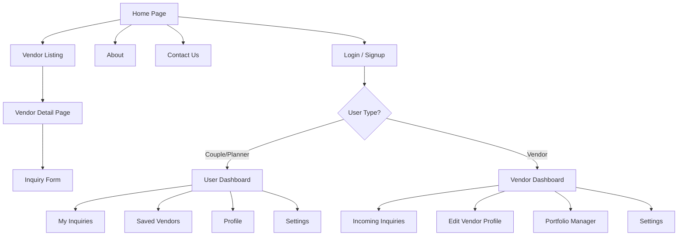
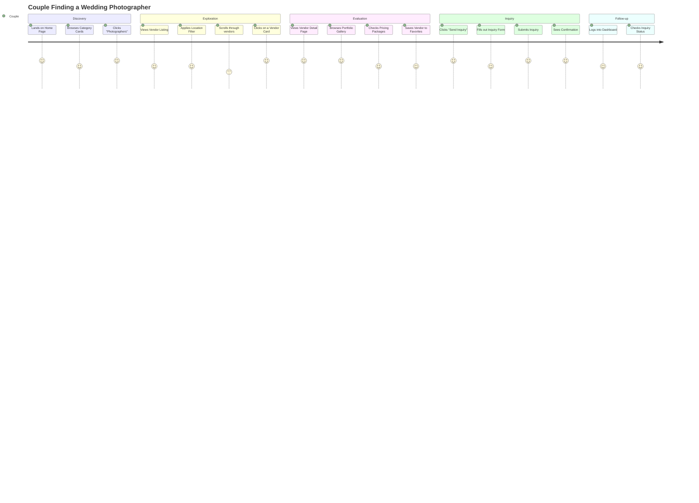
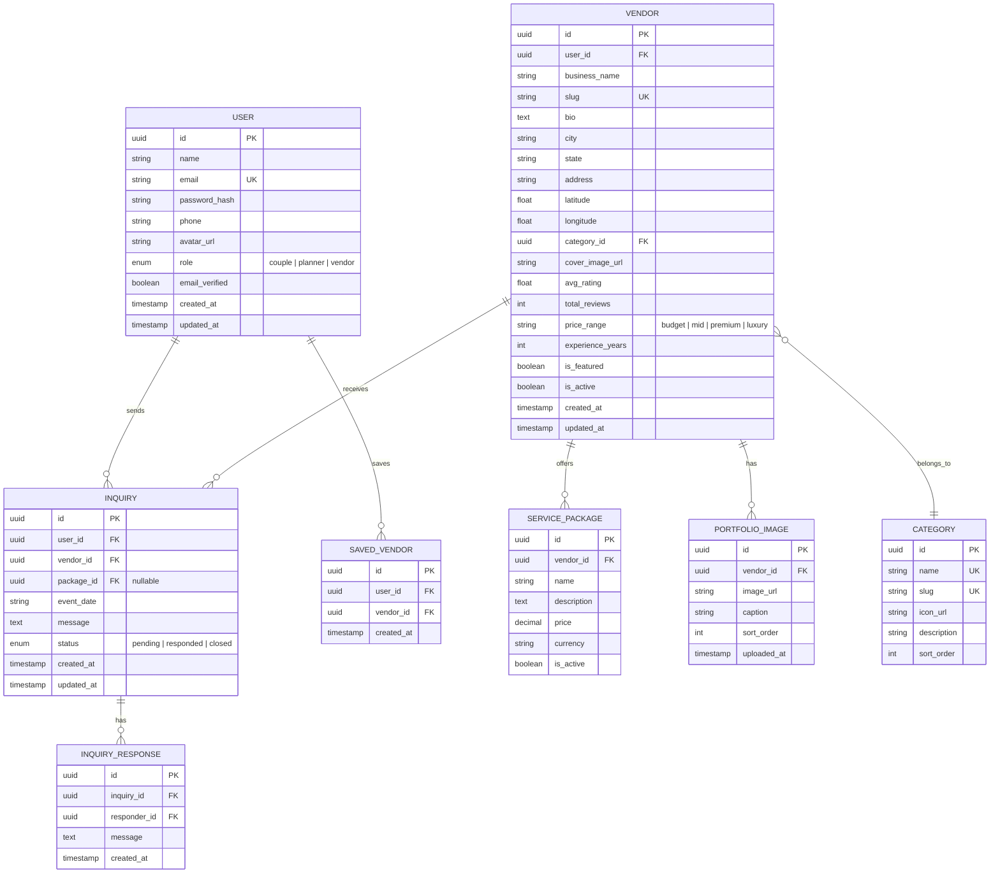

# WeddingVerse — Product Requirement Document (PRD)

> **Project Name:** WeddingVerse — Wedding Services Platform  
> **Version:** 1.0  
> **Date:** March 13, 2026  
> **Status:** Draft  

---

## Table of Contents

1. [Project Overview](#1-project-overview)  
2. [Target Audience](#2-target-audience)  
3. [Complete Page Structure](#3-complete-page-structure)  
4. [Core Features with Priority Levels](#4-core-features-with-priority-levels)  
5. [Detailed User Journey](#5-detailed-user-journey)  
6. [Database Entities Required](#6-database-entities-required)  
7. [Success Metrics](#7-success-metrics)  
8. [Future Scalable Features](#8-future-scalable-features)  

---

## 1. Project Overview

### 1.1 Vision

**WeddingVerse** is a modern, full-stack wedding services marketplace that connects couples planning their wedding with vetted, high-quality vendors — photographers, decorators, venues, makeup artists, planners, and more. The platform provides a seamless discovery, comparison, and inquiry experience for users while giving vendors a professional storefront to showcase their work.

### 1.2 Problem Statement

Couples planning weddings often rely on word-of-mouth, fragmented social media pages, or outdated directories to find and vet vendors. There is no unified, modern platform that lets them:

- **Discover** vendors across multiple categories in one place.
- **Compare** vendors based on pricing, reviews, location, and availability.
- **Inquire** directly with a streamlined contact flow.
- **Track** their shortlisted vendors and inquiry history.

### 1.3 Solution

WeddingVerse provides:

| Capability | Description |
|---|---|
| **Unified Vendor Directory** | A browsable, filterable catalog of wedding vendors across categories. |
| **Rich Vendor Profiles** | Individual vendor pages with portfolio galleries, pricing, reviews, and availability. |
| **Streamlined Inquiry Flow** | A built-in contact/inquiry form that logs requests and notifies vendors. |
| **User Dashboard** | A personalized space for users to manage inquiries, bookmarks, and profile. |
| **Vendor Dashboard** | A space for vendors to manage their profile, view inquiries, and update services. |

### 1.4 Tech Stack (Recommended)

| Layer | Technology |
|---|---|
| **Frontend** | Next.js (React), Vanilla CSS / Tailwind CSS |
| **Backend** | Node.js with Express.js (REST API) |
| **Database** | PostgreSQL (primary), Redis (caching) |
| **Authentication** | JWT-based auth with bcrypt password hashing |
| **File Storage** | Cloudinary or AWS S3 (vendor images/portfolios) |
| **Deployment** | Vercel (frontend), Railway / Render (backend), Supabase / Neon (DB) |

### 1.5 Scope

- **In Scope (v1.0):** User auth, vendor listing, vendor detail pages, inquiry form, user dashboard, vendor dashboard, search & filter, responsive design.
- **Out of Scope (v1.0):** Online payments/booking, real-time chat, vendor reviews by users, admin analytics dashboard, multi-language support.

---

## 2. Target Audience

### 2.1 Primary Users

| Persona | Description | Key Needs |
|---|---|---|
| **Couples** | Engaged couples actively planning their wedding (ages 22–40). | Discover vendors, compare options, send inquiries, save favorites. |
| **Wedding Planners** | Professional planners coordinating weddings on behalf of clients. | Quickly find and shortlist vendors, manage multiple event inquiries. |

### 2.2 Secondary Users

| Persona | Description | Key Needs |
|---|---|---|
| **Vendors** | Photographers, decorators, venues, MUAs, caterers, etc. | Showcase services, receive leads/inquiries, manage profile. |
| **Event Organizers** | Corporate or social event organizers who may need overlapping services. | Browse vendor catalogs, send bulk inquiries. |

### 2.3 User Demographics

- **Geography:** Initially targeting a single country/region; designed for scalability to multiple cities.
- **Device Usage:** 60% mobile, 30% desktop, 10% tablet (design must be mobile-first).
- **Tech Savviness:** Moderate — the UI must be intuitive and require zero onboarding.

---

## 3. Complete Page Structure

### 3.1 Public Pages (No Authentication Required)

```
/                           → Home Page
/vendors                    → Vendor Listing (browse all vendors)
/vendors?category=<cat>     → Filtered Vendor Listing by category
/vendors/:vendorId          → Vendor Detail Page
/vendors/:vendorId/inquiry  → Inquiry Form (can also be a modal on detail page)
/about                      → About WeddingVerse
/contact                    → Contact Us (general platform inquiries)
/login                      → User Login
/signup                     → User Registration
/forgot-password            → Password Reset Request
/reset-password/:token      → Password Reset Form
```

### 3.2 Authenticated Pages — User Dashboard

```
/dashboard                  → Dashboard Home (overview of activity)
/dashboard/inquiries        → My Inquiries (list of sent inquiries + status)
/dashboard/saved            → Saved / Bookmarked Vendors
/dashboard/profile          → Edit Profile (name, email, phone, avatar)
/dashboard/settings         → Account Settings (password change, notifications)
```

### 3.3 Authenticated Pages — Vendor Dashboard

```
/vendor/dashboard           → Vendor Dashboard Home (inquiry stats, quick actions)
/vendor/profile             → Edit Vendor Profile (bio, services, pricing, gallery)
/vendor/inquiries           → Incoming Inquiries (view, respond, mark status)
/vendor/portfolio           → Manage Portfolio (upload/remove images & videos)
/vendor/settings            → Vendor Account Settings
```

### 3.4 Sitemap Diagram



---

## 4. Core Features with Priority Levels

> **Priority Legend:**  
> 🔴 P0 — Must Have (launch blocker)  
> 🟡 P1 — Should Have (important for good UX)  
> 🟢 P2 — Nice to Have (can follow in v1.1+)

### 4.1 Authentication & User Management

| # | Feature | Priority | Description |
|---|---|---|---|
| F-01 | User Signup | 🔴 P0 | Email + password registration with role selection (couple/planner or vendor). |
| F-02 | User Login | 🔴 P0 | JWT-based login with secure session handling. |
| F-03 | Forgot / Reset Password | 🟡 P1 | Email-based password reset flow with tokenized links. |
| F-04 | Social Login (Google) | 🟢 P2 | OAuth 2.0 login via Google for faster onboarding. |
| F-05 | Email Verification | 🟡 P1 | Verify email after signup before full access. |

### 4.2 Home Page

| # | Feature | Priority | Description |
|---|---|---|---|
| F-06 | Hero Section | 🔴 P0 | Visually striking hero with CTA ("Find Your Vendors"). |
| F-07 | Vendor Category Cards | 🔴 P0 | Quick-access grid of categories (Photographers, Venues, etc.). |
| F-08 | Featured Vendors | 🟡 P1 | Carousel or grid of top/featured vendors. |
| F-09 | Testimonials | 🟡 P1 | Scrollable user testimonials/reviews. |
| F-10 | Search Bar | 🔴 P0 | Global search by vendor name, category, or location. |
| F-11 | How It Works Section | 🟡 P1 | 3-step visual guide (Search → Compare → Inquire). |
| F-12 | Footer | 🔴 P0 | Links: About, Contact, Privacy Policy, Social Media. |

### 4.3 Vendor / Service Listing

| # | Feature | Priority | Description |
|---|---|---|---|
| F-13 | Vendor Grid / List View | 🔴 P0 | Responsive card grid showing vendor name, category, image, location, rating. |
| F-14 | Category Filter | 🔴 P0 | Filter vendors by category (sidebar or top filter bar). |
| F-15 | Location Filter | 🟡 P1 | Filter by city or region. |
| F-16 | Price Range Filter | 🟡 P1 | Slider or bracket-based price filter. |
| F-17 | Sort Options | 🟡 P1 | Sort by rating, popularity, price (low-high / high-low), newest. |
| F-18 | Pagination / Infinite Scroll | 🔴 P0 | Load vendors in paginated batches (20 per page). |
| F-19 | Bookmark / Save Vendor | 🟡 P1 | Heart icon to save a vendor to the user's list (requires auth). |

### 4.4 Vendor Detail Page

| # | Feature | Priority | Description |
|---|---|---|---|
| F-20 | Vendor Header | 🔴 P0 | Name, category, location, cover image, rating badge. |
| F-21 | About / Bio Section | 🔴 P0 | Vendor description, years of experience, specialties. |
| F-22 | Portfolio Gallery | 🔴 P0 | Image gallery (lightbox view) of past work. |
| F-23 | Services & Pricing | 🟡 P1 | Table or card list of offered packages with pricing. |
| F-24 | Availability Calendar | 🟢 P2 | Visual calendar showing available dates. |
| F-25 | Contact / Inquiry CTA | 🔴 P0 | Prominent button opening the inquiry form. |
| F-26 | Share Vendor | 🟢 P2 | Share vendor profile via link, WhatsApp, or social media. |

### 4.5 Contact / Inquiry Form

| # | Feature | Priority | Description |
|---|---|---|---|
| F-27 | Inquiry Form Fields | 🔴 P0 | Name, email, phone, event date, message, preferred service/package. |
| F-28 | Form Validation | 🔴 P0 | Client + server-side validation with clear error messages. |
| F-29 | Success Confirmation | 🔴 P0 | Confirmation screen/toast after submission. |
| F-30 | Email Notification to Vendor | 🟡 P1 | Auto-email sent to vendor upon new inquiry. |
| F-31 | Inquiry Logging | 🔴 P0 | All inquiries stored in DB, linked to user and vendor. |

### 4.6 User Dashboard

| # | Feature | Priority | Description |
|---|---|---|---|
| F-32 | Dashboard Overview | 🔴 P0 | Summary cards: total inquiries sent, saved vendors, recent activity. |
| F-33 | My Inquiries List | 🔴 P0 | Table/list of all inquiries with status (pending, responded, closed). |
| F-34 | Saved Vendors | 🟡 P1 | Grid of bookmarked vendors with quick links to their profiles. |
| F-35 | Edit Profile | 🔴 P0 | Update name, email, phone, avatar. |
| F-36 | Change Password | 🟡 P1 | Secure password update form. |

### 4.7 Vendor Dashboard

| # | Feature | Priority | Description |
|---|---|---|---|
| F-37 | Vendor Dashboard Overview | 🔴 P0 | Inquiry stats, profile completeness indicator, quick actions. |
| F-38 | Incoming Inquiries | 🔴 P0 | List of received inquiries with ability to view details and respond. |
| F-39 | Edit Vendor Profile | 🔴 P0 | Update bio, services, pricing, contact info. |
| F-40 | Portfolio Manager | 🟡 P1 | Upload, reorder, and delete portfolio images. |
| F-41 | Vendor Account Settings | 🟡 P1 | Notification preferences, account deletion. |

---

## 5. Detailed User Journey

### 5.1 Journey — Couple Finding a Photographer



### 5.2 Journey — Step-by-Step Flow

#### Flow A: New User → Vendor Discovery → Inquiry

| Step | Screen | User Action | System Response |
|---|---|---|---|
| 1 | Home Page | User lands on the site | Display hero, categories, featured vendors. |
| 2 | Home Page | Clicks "Photographers" category | Navigate to `/vendors?category=photographers`. |
| 3 | Vendor Listing | Browses vendor cards | Show paginated list with filters sidebar. |
| 4 | Vendor Listing | Applies "Mumbai" location filter | Re-fetch and display filtered results. |
| 5 | Vendor Listing | Clicks on "Rohan Studios" card | Navigate to `/vendors/rohan-studios`. |
| 6 | Vendor Detail | Views portfolio, pricing | Render gallery lightbox, pricing cards. |
| 7 | Vendor Detail | Clicks "Send Inquiry" | If logged in → open inquiry form. If not → redirect to login with return URL. |
| 8 | Login / Signup | User signs up with email | Create account, issue JWT, redirect back to vendor page. |
| 9 | Vendor Detail | Clicks "Send Inquiry" again | Open inquiry form modal/page. |
| 10 | Inquiry Form | Fills in event date, message, selects package | Client-side validation in real-time. |
| 11 | Inquiry Form | Clicks "Submit" | POST to API → save inquiry → send email to vendor → show confirmation. |
| 12 | Dashboard | Visits `/dashboard/inquiries` | See the new inquiry with status "Pending". |

#### Flow B: Vendor Receiving & Responding to an Inquiry

| Step | Screen | Vendor Action | System Response |
|---|---|---|---|
| 1 | Email | Receives inquiry notification email | Email contains summary + link to vendor dashboard. |
| 2 | Vendor Dashboard | Logs in and visits `/vendor/inquiries` | Display list of inquiries sorted by newest. |
| 3 | Inquiry Detail | Clicks on the inquiry | Show full inquiry details: user info, event date, message. |
| 4 | Inquiry Detail | Clicks "Respond" and types a reply | Save response, update inquiry status to "Responded". |
| 5 | — | — | User receives email notification that vendor has responded. |

---

## 6. Database Entities Required

### 6.1 Entity-Relationship Diagram



### 6.2 Entity Details

#### `users` Table

| Column | Type | Constraints | Description |
|---|---|---|---|
| `id` | UUID | PK, auto-generated | Unique user identifier. |
| `name` | VARCHAR(100) | NOT NULL | Full name. |
| `email` | VARCHAR(255) | UNIQUE, NOT NULL | Login email. |
| `password_hash` | VARCHAR(255) | NOT NULL | bcrypt-hashed password. |
| `phone` | VARCHAR(20) | NULLABLE | Contact phone number. |
| `avatar_url` | TEXT | NULLABLE | Profile photo URL. |
| `role` | ENUM | NOT NULL, DEFAULT 'couple' | `couple`, `planner`, or `vendor`. |
| `email_verified` | BOOLEAN | DEFAULT false | Whether email is verified. |
| `created_at` | TIMESTAMP | DEFAULT NOW() | Account creation timestamp. |
| `updated_at` | TIMESTAMP | AUTO-UPDATE | Last profile update. |

#### `vendors` Table

| Column | Type | Constraints | Description |
|---|---|---|---|
| `id` | UUID | PK | Unique vendor identifier. |
| `user_id` | UUID | FK → users.id, UNIQUE | Associated user account. |
| `business_name` | VARCHAR(200) | NOT NULL | Display name of the business. |
| `slug` | VARCHAR(200) | UNIQUE, NOT NULL | URL-friendly identifier. |
| `bio` | TEXT | NULLABLE | About section content. |
| `city` | VARCHAR(100) | NOT NULL | City of operation. |
| `state` | VARCHAR(100) | NULLABLE | State/province. |
| `address` | TEXT | NULLABLE | Full address. |
| `latitude` | FLOAT | NULLABLE | For map display. |
| `longitude` | FLOAT | NULLABLE | For map display. |
| `category_id` | UUID | FK → categories.id | Vendor's primary category. |
| `cover_image_url` | TEXT | NULLABLE | Cover/banner image. |
| `avg_rating` | FLOAT | DEFAULT 0.0 | Computed average rating. |
| `total_reviews` | INT | DEFAULT 0 | Total number of reviews. |
| `price_range` | ENUM | DEFAULT 'mid' | `budget`, `mid`, `premium`, `luxury`. |
| `experience_years` | INT | DEFAULT 0 | Years of experience. |
| `is_featured` | BOOLEAN | DEFAULT false | Whether vendor appears in featured section. |
| `is_active` | BOOLEAN | DEFAULT true | Whether vendor listing is live. |
| `created_at` | TIMESTAMP | DEFAULT NOW() | Profile creation time. |
| `updated_at` | TIMESTAMP | AUTO-UPDATE | Last profile update. |

#### `categories` Table

| Column | Type | Constraints | Description |
|---|---|---|---|
| `id` | UUID | PK | Unique category identifier. |
| `name` | VARCHAR(100) | UNIQUE, NOT NULL | Category display name (e.g., "Photographers"). |
| `slug` | VARCHAR(100) | UNIQUE, NOT NULL | URL-friendly slug. |
| `icon_url` | TEXT | NULLABLE | Category icon/image. |
| `description` | TEXT | NULLABLE | Brief description. |
| `sort_order` | INT | DEFAULT 0 | Display order on the home page. |

#### `service_packages` Table

| Column | Type | Constraints | Description |
|---|---|---|---|
| `id` | UUID | PK | Unique package identifier. |
| `vendor_id` | UUID | FK → vendors.id | Owning vendor. |
| `name` | VARCHAR(150) | NOT NULL | Package name (e.g., "Gold Package"). |
| `description` | TEXT | NULLABLE | What's included. |
| `price` | DECIMAL(10,2) | NOT NULL | Price in local currency. |
| `currency` | VARCHAR(3) | DEFAULT 'INR' | Currency code. |
| `is_active` | BOOLEAN | DEFAULT true | Whether package is visible. |

#### `portfolio_images` Table

| Column | Type | Constraints | Description |
|---|---|---|---|
| `id` | UUID | PK | Unique image identifier. |
| `vendor_id` | UUID | FK → vendors.id | Owning vendor. |
| `image_url` | TEXT | NOT NULL | Image file URL. |
| `caption` | VARCHAR(255) | NULLABLE | Image caption/alt text. |
| `sort_order` | INT | DEFAULT 0 | Display order. |
| `uploaded_at` | TIMESTAMP | DEFAULT NOW() | Upload timestamp. |

#### `inquiries` Table

| Column | Type | Constraints | Description |
|---|---|---|---|
| `id` | UUID | PK | Unique inquiry identifier. |
| `user_id` | UUID | FK → users.id | The user who sent the inquiry. |
| `vendor_id` | UUID | FK → vendors.id | The vendor receiving the inquiry. |
| `package_id` | UUID | FK → service_packages.id, NULLABLE | Optionally selected package. |
| `event_date` | DATE | NULLABLE | Desired event date. |
| `message` | TEXT | NOT NULL | Inquiry message body. |
| `status` | ENUM | DEFAULT 'pending' | `pending`, `responded`, `closed`. |
| `created_at` | TIMESTAMP | DEFAULT NOW() | Submission time. |
| `updated_at` | TIMESTAMP | AUTO-UPDATE | Last status update. |

#### `inquiry_responses` Table

| Column | Type | Constraints | Description |
|---|---|---|---|
| `id` | UUID | PK | Unique response identifier. |
| `inquiry_id` | UUID | FK → inquiries.id | Parent inquiry. |
| `responder_id` | UUID | FK → users.id | Who responded (vendor user). |
| `message` | TEXT | NOT NULL | Response message body. |
| `created_at` | TIMESTAMP | DEFAULT NOW() | Response timestamp. |

#### `saved_vendors` Table

| Column | Type | Constraints | Description |
|---|---|---|---|
| `id` | UUID | PK | Unique bookmark identifier. |
| `user_id` | UUID | FK → users.id | User who saved. |
| `vendor_id` | UUID | FK → vendors.id | Saved vendor. |
| `created_at` | TIMESTAMP | DEFAULT NOW() | Bookmark timestamp. |

> **Unique Constraint:** `(user_id, vendor_id)` on `saved_vendors` to prevent duplicate bookmarks.

---

## 7. Success Metrics

### 7.1 Launch Metrics (First 30 Days)

| Metric | Target | Measurement |
|---|---|---|
| **Registered Users** | 500+ | Count of verified user accounts. |
| **Vendor Profiles Created** | 50+ | Count of active vendor listings. |
| **Inquiries Sent** | 200+ | Total inquiry submissions. |
| **Inquiry Response Rate** | > 60% | % of inquiries that receive at least one vendor response. |
| **Avg. Session Duration** | > 3 minutes | Google Analytics / Mixpanel. |

### 7.2 Growth Metrics (Quarterly)

| Metric | Target | Measurement |
|---|---|---|
| **Monthly Active Users (MAU)** | 20% MoM growth | Unique logins per month. |
| **Vendor Retention** | > 70% | % of vendors active after 3 months. |
| **Inquiry Conversion Rate** | > 15% | Inquiries / total vendor page views. |
| **Bounce Rate** | < 40% | Google Analytics. |
| **Pages Per Session** | > 4 | Google Analytics. |

### 7.3 Quality Metrics

| Metric | Target | Measurement |
|---|---|---|
| **Page Load Time** | < 2 seconds | Lighthouse / Web Vitals. |
| **Lighthouse Performance Score** | > 90 | Lighthouse CI. |
| **Accessibility Score** | > 85 | Lighthouse / axe-core. |
| **API Response Time (p95)** | < 300ms | Server-side monitoring. |
| **Uptime** | > 99.5% | Uptime monitoring service. |

---

## 8. Future Scalable Features

### Phase 2 (v1.1) — Enhanced Engagement

| Feature | Description |
|---|---|
| **User Reviews & Ratings** | Allow verified users to leave star ratings and text reviews on vendor profiles. |
| **Real-Time Chat** | In-app messaging between users and vendors using WebSockets. |
| **Vendor Verification Badge** | Manual or automated verification process with a trust badge. |
| **Advanced Search** | Full-text search with autocomplete and typo tolerance (e.g., Algolia or Meilisearch). |
| **Push Notifications** | Browser and mobile push notifications for inquiry updates. |

### Phase 3 (v2.0) — Monetization & Growth

| Feature | Description |
|---|---|
| **Online Booking & Payments** | Stripe/Razorpay integration for direct booking and deposits. |
| **Vendor Subscription Plans** | Freemium model with paid tiers for premium placement and analytics. |
| **Admin Dashboard** | Internal dashboard for platform admins: user management, vendor approval, analytics. |
| **Multi-City Expansion** | City-based landing pages and localized vendor recommendations. |
| **SEO-Optimized Blog** | Wedding tips, trends, and guides to drive organic traffic. |

### Phase 4 (v3.0) — AI & Personalization

| Feature | Description |
|---|---|
| **AI Vendor Recommendations** | ML-based vendor suggestions based on user preferences, budget, and location. |
| **Wedding Budget Planner** | Interactive tool to allocate and track wedding budget across categories. |
| **Wedding Checklist** | Customizable checklist with timeline milestones. |
| **Mobile App (React Native)** | Dedicated iOS and Android app for on-the-go vendor discovery. |
| **Multi-Language Support** | i18n support for regional languages. |
| **Vendor Analytics Dashboard** | Detailed analytics for vendors: profile views, inquiry trends, conversion rates. |

---

## Appendix A: API Endpoints Overview

### Auth

| Method | Endpoint | Description |
|---|---|---|
| POST | `/api/auth/signup` | Register a new user. |
| POST | `/api/auth/login` | Login and receive JWT. |
| POST | `/api/auth/forgot-password` | Request password reset email. |
| POST | `/api/auth/reset-password` | Reset password with token. |
| GET | `/api/auth/me` | Get current user profile. |

### Vendors

| Method | Endpoint | Description |
|---|---|---|
| GET | `/api/vendors` | List vendors (paginated, filterable). |
| GET | `/api/vendors/:slug` | Get vendor detail by slug. |
| POST | `/api/vendors` | Create vendor profile (vendor role). |
| PUT | `/api/vendors/:id` | Update vendor profile. |
| GET | `/api/vendors/:id/portfolio` | Get vendor portfolio images. |
| POST | `/api/vendors/:id/portfolio` | Upload portfolio image. |
| DELETE | `/api/vendors/:id/portfolio/:imageId` | Remove portfolio image. |

### Categories

| Method | Endpoint | Description |
|---|---|---|
| GET | `/api/categories` | List all categories. |

### Inquiries

| Method | Endpoint | Description |
|---|---|---|
| POST | `/api/inquiries` | Submit a new inquiry. |
| GET | `/api/inquiries/sent` | Get inquiries sent by current user. |
| GET | `/api/inquiries/received` | Get inquiries received by vendor. |
| GET | `/api/inquiries/:id` | Get inquiry detail. |
| POST | `/api/inquiries/:id/respond` | Respond to an inquiry. |
| PATCH | `/api/inquiries/:id/status` | Update inquiry status. |

### Saved Vendors

| Method | Endpoint | Description |
|---|---|---|
| GET | `/api/saved-vendors` | Get user's saved vendors. |
| POST | `/api/saved-vendors/:vendorId` | Save a vendor. |
| DELETE | `/api/saved-vendors/:vendorId` | Unsave a vendor. |

### User Profile

| Method | Endpoint | Description |
|---|---|---|
| PUT | `/api/users/profile` | Update user profile. |
| PUT | `/api/users/password` | Change password. |
| PUT | `/api/users/avatar` | Upload avatar image. |

---

## Appendix B: Non-Functional Requirements

| Requirement | Specification |
|---|---|
| **Responsiveness** | Fully responsive across mobile (360px+), tablet (768px+), desktop (1280px+). |
| **Browser Support** | Chrome, Firefox, Safari, Edge (latest 2 versions). |
| **Security** | HTTPS everywhere, XSS protection, CSRF tokens, rate limiting, input sanitization. |
| **Performance** | Lazy-loaded images, code splitting, CDN for static assets. |
| **SEO** | Server-side rendering (Next.js), proper meta tags, structured data (JSON-LD). |
| **Accessibility** | WCAG 2.1 AA compliance, keyboard navigation, proper ARIA attributes. |
| **Error Handling** | Graceful error pages (404, 500), user-friendly error messages, error logging. |

---

*This PRD serves as the single source of truth for the WeddingVerse project. All development, design, and testing efforts should align with the specifications documented here.*
